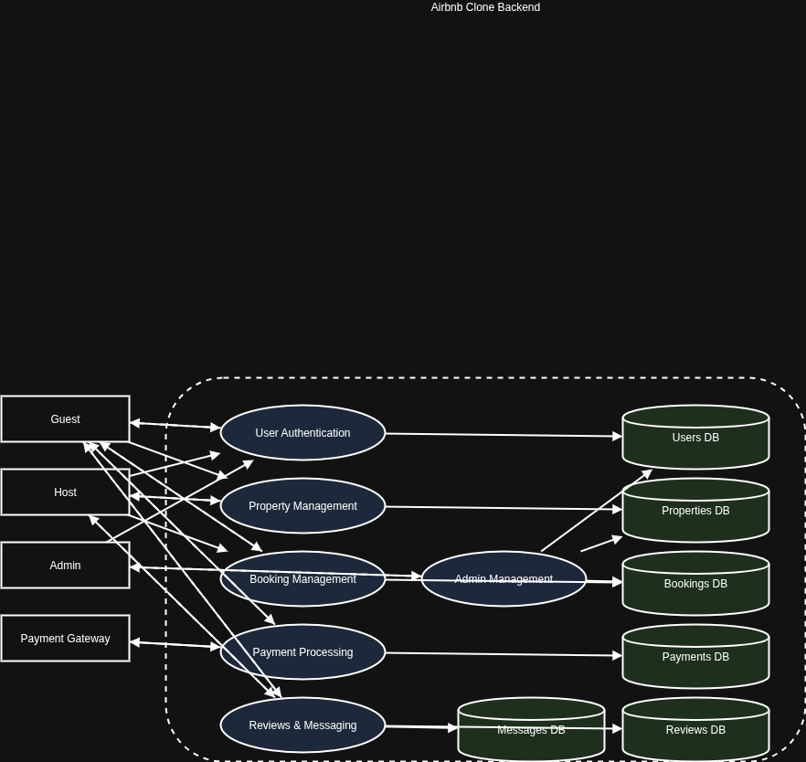

# Airbnb Clone – Data Flow Diagram

This document contains the **Data Flow Diagram (DFD)** for the Airbnb Clone backend.  
It illustrates how data moves between **actors (Guest, Host, Admin, Payment Gateway)**, **system processes**, and **data stores**.

---

## Key Elements

### External Entities
- **Guest:** Registers, searches, books properties, makes payments, leaves reviews, sends messages.
- **Host:** Manages property listings, views bookings, communicates with guests.
- **Admin:** Manages users, properties, bookings.
- **Payment Gateway:** Processes payments securely.

### Processes
1. **User Authentication** → Manages login/registration (interacts with Users DB).
2. **Property Management** → Create/edit/delete property listings (interacts with Properties DB).
3. **Booking Management** → Handles reservations (interacts with Bookings DB).
4. **Payment Processing** → Records payments (interacts with Payments DB and Payment Gateway).
5. **Review & Messaging** → Stores reviews and messages (interacts with Reviews and Messages DB).
6. **Admin Management** → Oversees users, properties, bookings (interacts with all DBs).

### Data Stores
- **Users DB**
- **Properties DB**
- **Bookings DB**
- **Payments DB**
- **Reviews DB**
- **Messages DB**

---

## Diagram

---

## Summary
The DFD maps how data flows in the Airbnb Clone backend:
- Users interact with the system via processes.
- Processes read/write data from relevant databases.
- The Payment Gateway integrates with the Payment process for external transactions.
