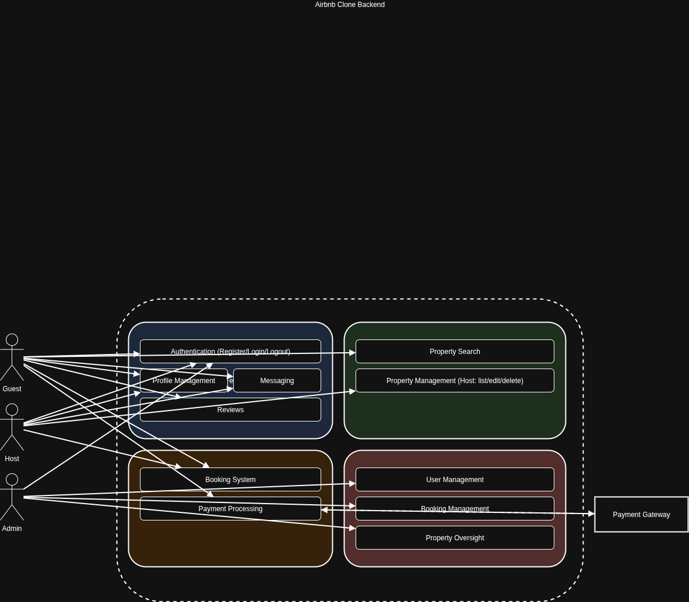

# Airbnb Clone Backend – Features and Functionalities

This document outlines the **core features and functionalities** required for the Airbnb Clone backend, based on the project requirements specification.

---

## 1. User Management
- **User Registration & Authentication**
  - Register as a new user (guest, host, or admin).
  - Login/Logout functionality.
  - Password hashing (bcrypt).
  - Email uniqueness validation.
- **User Roles**
  - Guest → can browse and book properties.
  - Host → can list/manage properties.
  - Admin → system oversight and moderation.
- **Profile Management**
  - Update user details (name, phone number, etc.).
  - View booking and hosting history.

---

## 2. Property Management
- **Property Listings**
  - Create new property (name, description, location, price per night).
  - Edit or delete properties (host-only).
  - Upload images (future scope).
- **Search & Filter**
  - Browse all properties.
  - Search by location, price, availability.

---

## 3. Booking System
- **Reservations**
  - Create booking request (guest).
  - Confirm/Cancel bookings.
  - Track booking status (pending, confirmed, canceled).
- **Availability Management**
  - Ensure properties cannot be double-booked.
  - Date-based availability tracking.

---

## 4. Payments
- **Payment Processing**
  - Integrate with Stripe or PayPal API.
  - Pay per booking (single or installment).
  - Store transaction history.
- **Refunds**
  - Handle cancellations and partial refunds.

---

## 5. Reviews & Ratings
- **User Feedback**
  - Guests can leave reviews for properties.
  - Ratings system (1–5).
  - Hosts can view reviews.

---

## 6. Messaging System
- **Direct Messaging**
  - Guests ↔ Hosts communication.
  - Send/receive messages within platform.
  - Timestamped conversation history.

---

## 7. Admin Features
- **System Oversight**
  - Manage users, properties, and bookings.
  - Handle disputes.
  - Access to system logs.

---

## 8. Security & Authorization
- JWT-based authentication.
- Role-based access control.
- Data validation for API requests.

---

## 9. Future Enhancements (Optional Scope)
- Wishlist/Favorites.
- Notifications (email/SMS).
- Multi-language support.
- Property image uploads.
- Analytics dashboard for hosts.

---

## Diagram
The following diagram provides a high-level overview of the Airbnb Clone backend features and interactions:

---

## Summary
The Airbnb Clone backend will provide a **full-featured booking and hosting platform** with:
- User management (guests, hosts, admins).
- Property listings & search.
- Booking reservations.
- Secure payments.
- Reviews & messaging.

This document serves as the **blueprint** for developers before implementation.
