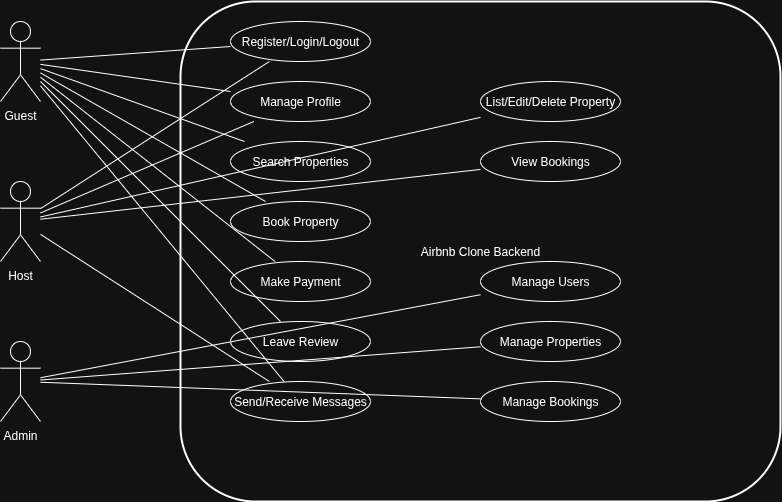

# Airbnb Clone Backend – Use Case Diagram

This document provides a **Use Case Diagram** for the Airbnb Clone backend.  
It shows how different actors (Guest, Host, Admin) interact with the system and its key functionalities.

---

## Actors
- **Guest**
  - Registers, logs in, manages profile.
  - Searches for properties.
  - Books properties and makes payments.
  - Leaves reviews.
  - Sends/receives messages with hosts.

- **Host**
  - Registers, logs in, manages profile.
  - Lists, edits, and deletes properties.
  - Views bookings and communicates with guests.
  - Responds to reviews.

- **Admin**
  - Manages users, properties, and bookings.
  - Oversees the system and resolves disputes.

---

## Key Use Cases
- **User Management**
  - Register/Login/Logout
  - Manage profile

- **Property Management**
  - List property
  - Edit/Delete property
  - Search properties

- **Booking System**
  - Book property
  - Cancel booking
  - Manage availability

- **Payments**
  - Make payment
  - Request refund

- **Reviews**
  - Leave review
  - View reviews

- **Messaging**
  - Send/receive messages

- **Admin Features**
  - Manage users
  - Manage properties
  - Manage bookings

---

## Diagram

---

## Summary
The Use Case Diagram illustrates the **interactions between users (Guest, Host, Admin) and the system**.  
It provides a high-level view of how different actors achieve their goals through the Airbnb Clone backend.
